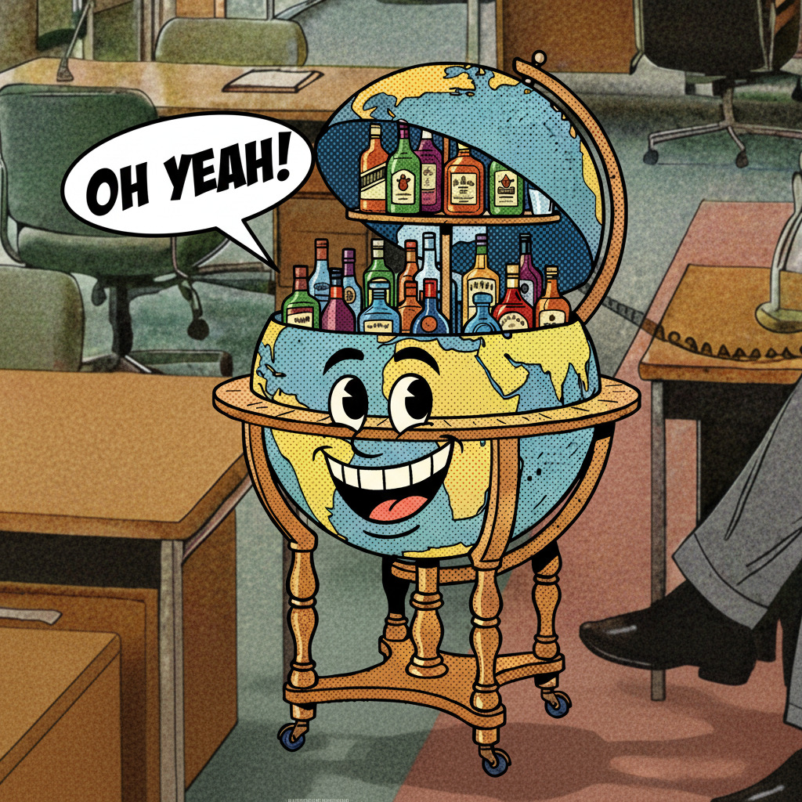

# nano-agent
<p align="center">
  
</p>


nano-agent is a CLI for generating, editing and compositing images using Google's `gemini-2.5-flash-image-preview` ("Nano Banana") model.

## Features
- Generate images from a prompt directly from the terminal
- Pass in images to edit or composite with a prompt
- Support for reusable prompt fragments via `-f/--fragment`
- Support for critique-improve feedback loops via `-cl/--critique-loops`

## Install

### macOS (Homebrew):
```bash
brew tap rkirkendall/tap
brew install rkirkendall/tap/nano-agent
```

### Windows (PowerShell, one‑liner; adds to PATH for current user):
(lol idk if this actually works but try it?)
<details>
<summary>

Set `GEMINI_API_KEY` in your environment (e.g., in a local `.env` or your shell). If you don’t have one yet, get a key from [Google AI Studio](https://aistudio.google.com/apikey).

```bash
export GEMINI_API_KEY=your_key_here
```

## Usage

- With reusable fragments (style only):
```bash
nano-agent examples/isometric/input.png \
-p "Focus on the building" \
-o examples/isometric/lux-palace.png \
-f examples/isometric/isometric-style.txt
```
<p align="center">
  
    
</p>

- Generate a comic-styled panel from a prompt (uses the comic style fragment):
```bash
nano-agent examples/comic/characters/barly.png \
  -p "Barly the bar cart similing and saying OH YEAH in a dialog bubble." \
  -f examples/comic/fragments/comic-style.txt \
  -o examples/comic/panels/two.png
```
<p align="center">
  
</p>


- Compose a character into a place to form a panel:
```bash
nano-agent -p "Compose as a left-facing medium shot; keep character proportions. Dan says in a dialog bubble: Yeah I could use a drink." \
  examples/comic/characters/dan.png \
  examples/comic/place/office.png \
  -f examples/comic/fragments/comic-style.txt \
  -o examples/comic/panels/one.png
```

<p align="center">
  
</p>

- Multi-image composition (two characters + a place):
```bash
nano-agent -p "Two-character panel in the office; Dan on right, Barly on left. Dan says CHEERS!" \
  examples/comic/characters/dan.png \
  examples/comic/characters/barly.png \
  examples/comic/place/office.png \
  -f examples/comic/fragments/comic-style.txt \
  -o examples/comic/panels/panel_dan_barly_office.png
```
<p align="center">
  
</p>

- Run critique-improve loops on a produced panel (`-cl` is supported):
```bash
nano-agent -p "Tighten line work and add stronger rim light" \
  examples/comic/panels/panel_dan_office.png \
  -cl 3 \
  -o examples/comic/panels/panel_dan_office_v2.png
# Iterations are saved to: examples/comic/panels/outputs/panel_dan_office_v2_improved_1.png, _2.png, _3.png
```

## Version & updates
- Print version: `nano-agent -v` (or `--version`)
- macOS updates follow Homebrew: `brew update && brew upgrade rkirkendall/tap/nano-agent`

## Build from source (optional)
Prerequisites: Go 1.21+

```bash
git clone https://github.com/rkirkendall/nano-agent.git
cd nano-agent
go build ./cmd/nano-agent
./nano-agent --help
```

Auto-update: on startup, the CLI checks GitHub for a newer version and prints an upgrade hint if available.

## Contributing

### Code structure map

- `cmd/nano-agent/main.go`: CLI entry point
- `internal/cmd/root.go`: Cobra command, flags, argument normalization, CLI loop
- `internal/ai/gemini.go`: Provider selection, OpenRouter transport, Gemini SDK calls, parsing
- `internal/generate/`: prompt builders for generation and improvement
  - `prompt.go`: merges main prompt with fragments
  - `improve.go`: builds improvement prompt from original prompt and critique
- `internal/critique/`: critique prompt templates and follow-up helpers
  - `prompt.go`: unified critique instruction text
  - `followup.go`: helpers for follow-up logic (if used)
- `internal/version/`: version string


## Configuration
- Environment variable: `GEMINI_API_KEY` (required for Google Gemini)
- `.env` is auto-read if present; existing environment vars are not overridden.

### OpenRouter (optional)
You can route all generation and critique through OpenRouter instead of Google Gemini.

- Set the following environment variables:
  - `USE_OPENROUTER=1` — enables OpenRouter routing
  - `OPENROUTER_API_KEY` — your OpenRouter API key
  - `OPENROUTER_MODEL` — optional override of the default model used via OpenRouter
  - Optional:
    - `OPENROUTER_BASE_URL` — defaults to `https://openrouter.ai/api/v1`
    - `OPENROUTER_SITE` — sets HTTP-Referer header (default `http://localhost`)
    - `OPENROUTER_TITLE` — sets X-Title header (default `nano-agent`)

- Example (bash):
```bash
export USE_OPENROUTER=1
export OPENROUTER_API_KEY=your_openrouter_key
# optional model override (defaults to google/gemini-2.5-flash-image-preview:free)
# export OPENROUTER_MODEL="google/gemini-2.5-flash-image-preview"
# optional:
# export OPENROUTER_SITE=https://your.app
# export OPENROUTER_TITLE="nano-agent"

# Generate an image (OpenRouter chat/completions; images saved as PNG)
nano-agent -p "Generate a beautiful sunset over mountains" -o output-openrouter.png
```

Notes:
- The default model remains `gemini-2.5-flash-image-preview` and works via OpenRouter without changes.
- Image inputs are supported; pass one or more `--images` paths or positional image paths as shown in the examples above.
- Critique loops (`-cl/--critique-loops`) are supported with OpenRouter as well.

### Troubleshooting
- If you see an HTML response from OpenRouter, ensure you’re hitting the API endpoint (`https://openrouter.ai/api/v1`) and that the `Authorization` and `Content-Type: application/json` headers are set. `.env` loading is supported, but shell exports take precedence.
- If you get a 402 credits error, reduce output length (the tool already requests reasonable token budgets) or upgrade credits in OpenRouter.

## Uninstall

### macOS (Homebrew):
```