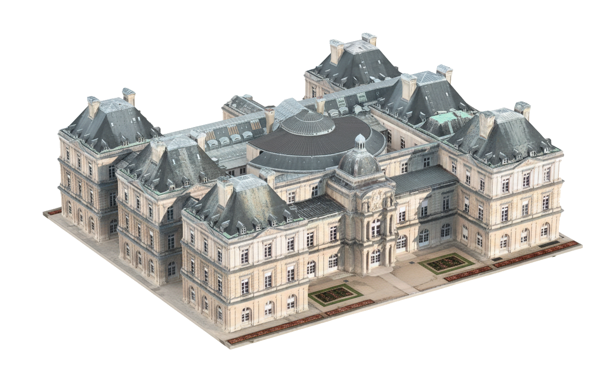

# nano-agent
<p align="center">
  
</p>


nano-agent is a CLI for generating, editing and compositing images using Google's `gemini-3-pro-image-preview` ("Nano Banana") model.

## Features
- Generate images from a prompt directly from the terminal
- Pass in images to edit or composite with a prompt
- Support for reusable prompt fragments via `-f/--fragment`
- Support for critique-improve feedback loops via `-cl/--critique-loops`
- Threaded critique-improve loops that append feedback to the original generation thread (Gemini + OpenRouter) to reduce artifacts/pixelation across iterations
- Verbose mode `-V/--verbose` logs per-iteration file size and SHA-256 so you can verify the latest image is being critiqued
- Support for aspect ratio (`--aspect-ratio`) and resolution (`--resolution`) configuration (Gemini 3 models only)

## Install

### macOS (Homebrew):
```bash
brew tap rkirkendall/tap
brew install rkirkendall/tap/nano-agent
```

### Windows (PowerShell):
```powershell
powershell -ExecutionPolicy Bypass -c "iwr https://raw.githubusercontent.com/rkirkendall/nano-agent/main/scripts/install.ps1 -UseB | iex"
```

Set `GEMINI_API_KEY` in your environment (e.g., in a local `.env` or your shell). If you don’t have one yet, get a key from [Google AI Studio](https://aistudio.google.com/apikey).

```bash
export GEMINI_API_KEY=your_key_here
```

## Usage

- With reusable fragments (style only):
```bash
nano-agent examples/isometric/input.png \
-p "Focus on the building" \
-o examples/isometric/lux-palace.png \
-f examples/isometric/isometric-style.txt
```
<p align="center">
  
    
</p>

- Generate a comic strip with 3 panels (Gemini 3 Pro Image):
```bash
# Panel 1: Dan at work
nano-agent examples/comic/characters/dan.png examples/comic/place/office.png \
  -p "Wide cinematic shot. Dan sitting at his desk in a messy office, looking tired. A speech bubble says 'ANOTHER LONG NIGHT...'." \
  -f examples/comic/fragments/comic-style.txt \
  --aspect-ratio 16:9 \
  -o examples/comic/panels/panel_1.png

# Panel 2: Barly arrives
nano-agent examples/comic/characters/barly.png examples/comic/place/office.png \
  -p "Medium shot. Barly the bar cart rolls into the office from the left, looking cheerful. A speech bubble says 'TIME FOR A BREAK, BOSS!'." \
  -f examples/comic/fragments/comic-style.txt \
  --aspect-ratio 16:9 \
  -o examples/comic/panels/panel_2.png

# Panel 3: Cheers
nano-agent examples/comic/characters/dan.png examples/comic/characters/barly.png examples/comic/place/office.png \
  -p "Close up two-shot. Dan and Barly clinking a glass and a bottle. Dan smiles. A speech bubble says 'YOU'RE A LIFESAVER, BARLY!'." \
  -f examples/comic/fragments/comic-style.txt \
  --aspect-ratio 16:9 \
  -o examples/comic/panels/panel_3.png
```

<p align="center">
  <br>
  <br>
  
</p>

- Run critique-improve loops on a produced panel (`-cl` is supported):
```bash
nano-agent -p "Tighten line work and add stronger rim light" \
  examples/comic/panels/panel_dan_office.png \
  -cl 3 \
  -V \
  -o examples/comic/panels/panel_dan_office_v2.png
# Iterations are saved to: examples/comic/panels/outputs/panel_dan_office_v2_improved_1.png, _2.png, _3.png
# With -V, each iteration logs the critiqued and updated image sizes and SHA-256
```

## Version & updates
- Print version: `nano-agent -v` (or `--version`)
- macOS updates follow Homebrew: `brew update && brew upgrade rkirkendall/tap/nano-agent`

## Build from source (optional)
Prerequisites: Go 1.21+

```bash
git clone https://github.com/rkirkendall/nano-agent.git
cd nano-agent
go build ./cmd/nano-agent
./nano-agent --help
```

Auto-update: on startup, the CLI checks GitHub for a newer version and prints an upgrade hint if available.

## Contributing

## Configuration
The CLI automatically loads a `.env` file from the current directory if present.

### Google Gemini (Native)
Set the `GEMINI_API_KEY` environment variable.

```bash
export GEMINI_API_KEY=your_gemini_key
```

The default model is `models/gemini-3-pro-image-preview`. You can override it by setting the `MODEL` environment variable:

```bash
export MODEL=models/gemini-3-pro-image-preview
```

### Advanced Generation (Gemini 3 only)
When using Gemini 3 models, you can specify aspect ratio and resolution:

```bash
nano-agent -p "..." --aspect-ratio 16:9 --resolution 2K
```

### OpenRouter (Alternative)
You can route requests through OpenRouter by prefixing the model name with `openrouter/`.

- Set `OPENROUTER_API_KEY` to your OpenRouter key.
- Set `MODEL` to start with `openrouter/`.

Example:
```bash
export OPENROUTER_API_KEY=your_openrouter_key
# Uses OpenRouter to call the same Gemini model
export MODEL=openrouter/google/gemini-3-pro-image-preview
```

Optional OpenRouter settings:
- `OPENROUTER_BASE_URL` — defaults to `https://openrouter.ai/api/v1`
- `OPENROUTER_SITE` — sets HTTP-Referer header (default `http://localhost`)
- `OPENROUTER_TITLE` — sets X-Title header (default `nano-agent`)

### Legacy Configuration (Deprecated)
The old `USE_OPENROUTER=1` configuration is supported but deprecated. It forces OpenRouter usage regardless of the model prefix.

```bash
# DEPRECATED way
export USE_OPENROUTER=1
export OPENROUTER_API_KEY=...
```

### Troubleshooting
- If you see an HTML response (e.g., Cloudflare 503), it indicates a temporary provider outage. Retry after a minute, switch models, or unset `USE_OPENROUTER` to use the native Gemini SDK.
- To debug OpenRouter requests, set `OPENROUTER_DEBUG=1` to print request/response diagnostics to stderr.
- If critiques feel repetitive, run with `-V` to confirm each loop critiques the latest image (sizes and SHA-256 will change per iteration if updates apply).
- If you get a 402 credits error, reduce output length or upgrade credits in OpenRouter.
